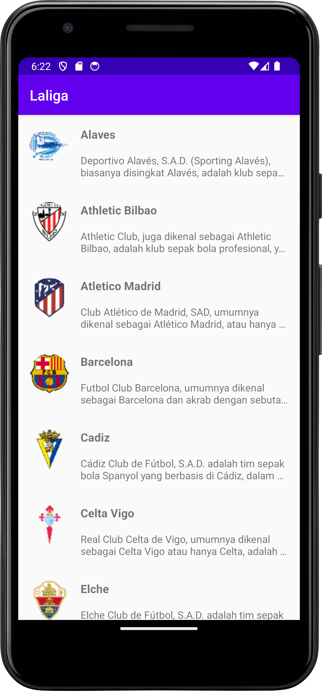
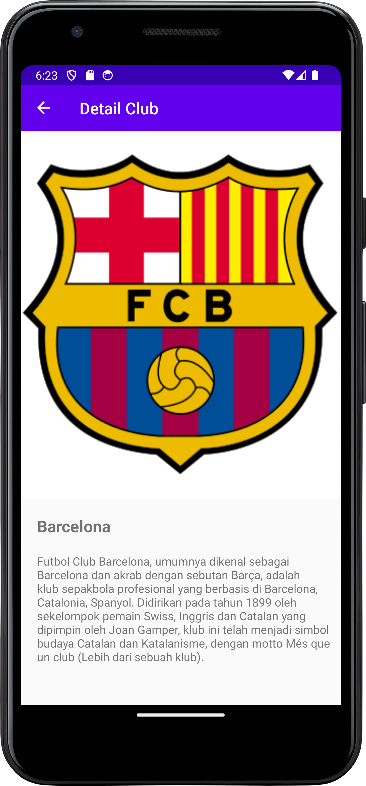
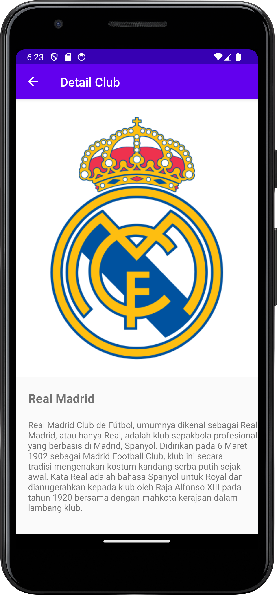

# LaLiga Club Information App (Java)

Jun 10, 2021 | Built in 10th grade at vocational school, this app displays LaLiga club information using a list and detail flow, helping me practice RecyclerView, image loading, and basic navigation.
I picked the LaLiga API because I’m a Barcelona fan, Visca Barca ! ! ! 💙❤

---

## Preview (Screenshots)

| Home / Club List | Club Detail 1 | Club Detail 2 |
|---|---|---|
|  |  |  |

---

## Features

- Display a list of football clubs (LaLiga)
- Club detail screen (logo/image + description)
- Image loading with Glide
- Circular images using CircleImageView
- RecyclerView-based UI

---

## Tech Stack

- **Language:** Java  
- **Build System:** Gradle  
- **UI:** ConstraintLayout, RecyclerView  
- **Libraries:**  
  - AndroidX AppCompat  
  - RecyclerView  
  - Glide  
  - CircleImageView  
- **compileSdk / targetSdk:** 30  
- **minSdk:** 16  

---

## Project Structure (High Level)

- `app/` - Android application module
- `app/src/main/java/...` - Activities, adapters, models
- `app/src/main/res/` - Layouts, drawables, strings, themes
- `gradle/` + `gradlew*` - Gradle wrapper files
- `docs/` - Screenshots for README

---

## Getting Started

### Requirements
- Android Studio (recommended: a modern version)
- JDK 11
- Android SDK Platform 30 installed (compileSdk 30)

### Run Locally
1. Clone the repository:
   ```bash
   git clone https://github.com/Aryosetowmn/androiddev_kelas10semester2.git
   ```
2. Open the project in **Android Studio**
3. Wait for **Gradle Sync** to finish
4. Run on:
   - Emulator (Device Manager), or
   - Physical Android device (USB Debugging enabled)

---

## Notes

This repository is intended for learning and portfolio demonstration.  
For real-world apps, consider using an API, local database (Room), and a proper architecture (e.g., MVVM) for scalability.

---

## Author

**Aryosetowmn**  
Repository: `Aryosetowmn/androiddev_kelas10semester2`
